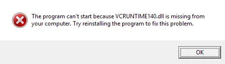

# dkml-workflows

GitLab CI/CD, GitHub Actions and desktop scripts to setup DkML compilers. DkML helps you distribute native OCaml applications on the most common operating systems.

Table of Contents:

- [dkml-workflows](#dkml-workflows)
  - [Configure your project](#configure-your-project)
    - [`ci/build-test.sh`](#cibuild-testsh)
  - [Examples](#examples)
  - [Using the GitLab CI/CD backend](#using-the-gitlab-cicd-backend)
  - [Using the GitHub Actions backend](#using-the-github-actions-backend)
  - [Using the Personal Computer backend](#using-the-personal-computer-backend)
    - [Windows backend](#windows-backend)
    - [macOS backend](#macos-backend)
    - [Linux backends](#linux-backends)
  - [Distributing your executable](#distributing-your-executable)
    - [Distributing your Windows executables](#distributing-your-windows-executables)
  - [Advanced Usage](#advanced-usage)
    - [Job Inputs](#job-inputs)
      - [SKIP\_OPAM\_MODIFICATIONS](#skip_opam_modifications)
      - [SECONDARY\_SWITCH](#secondary_switch)
      - [CACHE\_PREFIX](#cache_prefix)
      - [PRIMARY\_SWITCH\_SKIP\_INSTALL](#primary_switch_skip_install)
    - [Matrix Variables](#matrix-variables)
      - [gl\_image](#gl_image)
      - [gh\_os](#gh_os)
      - [opam\_root](#opam_root)
      - [vsstudio\_hostarch](#vsstudio_hostarch)
      - [vsstudio\_arch](#vsstudio_arch)
      - [vsstudio\_(others)](#vsstudio_others)
      - [ocaml\_options](#ocaml_options)
  - [Sponsor](#sponsor)

This project gives you:

- "`compilers`" workflow scripts to build and automatically create releases of OCaml native executables

Other types of workflow scripts may be added in the future.

In contrast to the conventional [setup-ocaml](https://github.com/marketplace/actions/set-up-ocaml) GitHub Action:

| `compilers`                          | `setup-ocaml`             | Consequence                                                                                                                                                                                                                                                                                               |
| ------------------------------------ | ------------------------- | --------------------------------------------------------------------------------------------------------------------------------------------------------------------------------------------------------------------------------------------------------------------------------------------------------- |
| dkml-base-compiler                   | ocaml-base-compiler       | `compilers` **only supports 4.14.0 today**. `setup-ocaml` supports all versions and variants of OCaml including OCaml 5                                                                                                                                                                                   |
| GitHub Local Action                  | GitHub Marketplace Action | `compilers` uses local scripts to implement the GitHub build logic, while `setup-ocaml` is distributed through GitHub Marketplace which is easier to use                                                                                                                                                  |
| GitLab CI/CD Local Include           | *not supported*           | `compilers` supports GitLab CI/CD                                                                                                                                                                                                                                                                         |
| Personal Computer Scripts            | *not supported*           | `compilers` can generates scripts to simulate CI on your personal computer for troubleshooting                                                                                                                                                                                                            |
| MSVC + MSYS2                         | GCC + Cygwin              | On Windows `compilers` can let your native code use ordinary Windows libraries without ABI conflicts. You can also distribute your executables without the license headache of redistributing or statically linking `libgcc_s_seh` and `libstdc++`                                                        |
| dkml-base-compiler                   | ocaml-base-compiler       | On macOS, `compilers` cross-compiles to ARM64 with `dune -x darwin_arm64`                                                                                                                                                                                                                                 |
| CentOS 7 and Linux distros from 2014 | Latest Ubuntu             | On Linux, `compilers` builds with an old GLIBC. `compilers` dynamically linked Linux executables will be highly portable as GLIBC compatibility issues should be rare, and compatible with the unmodified LGPL license used by common OCaml dependencies like [GNU MP](https://gmplib.org/manual/Copying) |
| 1 yrs                                | 4 yrs                     | `setup-ocaml` is officially supported and well-tested.                                                                                                                                                                                                                                                    |
| Some pinned packages                 | No packages pinned        | `compilers`, for some packages, must pin the version so that cross-platform patches (especially for Windows) are available. With `setup-ocaml` you are free to use any version of any package                                                                                                             |
| diskuv/diskuv-opam-repository        | fdopen/opam-repository    | Custom patches for Windows are sometimes needed. `compilers` uses a much smaller set of patches. `setup-ocaml` uses a large but deprecated set of patches.                                                                                                                                                |

> Put simply, use the `compilers` workflows when you are distributing executables or libraries to the public. Use `setup-ocaml` for all other needs.

The `compilers` workflows will setup the following OCaml build environments for you:

| ABIs                         | Native `ocamlopt` compiler supports building executables for the following operating systems:                                            |
| ---------------------------- | ---------------------------------------------------------------------------------------------------------------------------------------- |
| `win32-windows_x86`          | 32-bit Windows [1] for Intel/AMD CPUs                                                                                                    |
| `win32-windows_x86_64`       | 64-bit Windows [1] for Intel/AMD CPUs                                                                                                    |
| `macos-darwin_all`           | 64-bit macOS for Intel and Apple Silicon CPUs. Using `dune -x darwin_arm64` will cross-compile [2] to both; otherwise defaults to Intel. |
| `manylinux2014-linux_x86`    | 32-bit Linux: CentOS 7, CentOS 8, Fedora 32+, Mageia 8+, openSUSE 15.3+, Photon OS 4.0+ (3.0+ with updates), Ubuntu 20.04+               |
| `manylinux2014-linux_x86_64` | 64-bit Linux: CentOS 7, CentOS 8, Fedora 32+, Mageia 8+, openSUSE 15.3+, Photon OS 4.0+ (3.0+ with updates), Ubuntu 20.04+               |

> **[1]** See [Distributing your Windows executables](#distributing-your-windows-executables) for further details
>
> **[2]** Cross-compiling typically requires that you use Dune to build all your OCaml package dependencies.
> [opam monorepo](https://github.com/ocamllabs/opam-monorepo#readme) makes it easy to do exactly that.
> Alternatively you can directly use [findlib toolchains](http://projects.camlcity.org/projects/dl/findlib-1.9.3/doc/ref-html/r865.html).

You can follow the sections on this page, or you can copy one of the examples:

| Example                                                                                      | Who For                                                                                                                                         |
| -------------------------------------------------------------------------------------------- | ----------------------------------------------------------------------------------------------------------------------------------------------- |
| [dkml-workflows-regular-example](https://github.com/diskuv/dkml-workflows-regular-example)   | Everybody else                                                                                                                                  |
| [dkml-workflows-monorepo-example](https://github.com/diskuv/dkml-workflows-monorepo-example) | **Not ready for public use yet!**<br>You want to cross-compile ARM64 on Mac Intel.<br>You are building [Mirage unikernels](https://mirage.io/). |

For news about DkML,
[](https://twitter.com/diskuv) on Twitter.

## Configure your project

FIRST, let's ensure you have a `./dk` in your project ...

- On Windows **PowerShell**, macOS and desktop Linux:

  ```sh
  git clone https://gitlab.com/diskuv/dktool.git
  dktool/dk user.dkml.wrapper.upgrade HERE
  ./dk dkml.wrapper.upgrade DONE
  ```

- Or in Windows **Command Prompt**:

  ```dosbatch
  git clone https://gitlab.com/diskuv/dktool.git
  dktool\dk user.dkml.wrapper.upgrade HERE
  .\dk dkml.wrapper.upgrade DONE
  ```

SECOND, create the scaffolding files with **one** of the following options ...

```sh
# FYI: You can get help to see what will happen with:
#         ./dk dkml.workflow.compilers HELP

# If you want GitHub scripts
./dk dkml.workflow.compilers CI GitHub

# If you want GitHub scripts, but only for Windows CI
./dk dkml.workflow.compilers CI GitHub OS Windows

# If you want just GitLab script
./dk dkml.workflow.compilers CI GitLab
```

and then commit the new files that were created ....

```sh
git add -A
git update-index --chmod=+x ./dk ci/build-test.sh
git commit -m "ci: DkML compilers"
```

### `ci/build-test.sh`

The `./dk dkml.workflow.compilers ...` command will have created a `ci/build-test.sh` POSIX shell script for you if it wasn't present already.

Your build logic will be inside the `ci/build-test.sh` script. This will work even on Windows; just be careful on Windows that you save the shell script with **LF line endings (not CRLF), and use UTF-8 encoding**.

The [Examples](#examples) section has comprehensive examples.

*The script does not need to be named `ci/build-test.sh`. However the documentation and the auto-generated scripts (which you can change) assumes that filename.*

## Examples

The full list of examples is:

| Example                                                                                      | Who For                                                                                                                                         |
| -------------------------------------------------------------------------------------------- | ----------------------------------------------------------------------------------------------------------------------------------------------- |
| [dkml-workflows-monorepo-example](https://github.com/diskuv/dkml-workflows-monorepo-example) | **Not ready for public use yet!**<br>You want to cross-compile ARM64 on Mac Intel.<br>You are building [Mirage unikernels](https://mirage.io/). |
| [dkml-workflows-regular-example](https://github.com/diskuv/dkml-workflows-regular-example)   | Everybody else                                                                                                                                  |

## Using the GitLab CI/CD backend

> macOS runners are not available in the GitLab CI/CD shared fleet unless
> you apply and are approved at
> <https://gitlab.com/gitlab-com/runner-saas-macos-access-requests/-/issues/new>. More details are
> available at <https://gitlab.com/gitlab-com/runner-saas-macos-access-requests/-/blob/main/README.md>
>
> This documentation assumes you have not been approved. Look inside .gitlab-ci.yml
> and uncomment the macos:build section once you have been approved for macOS.

The [Examples](#examples) include more features, like the uploading and releasing of your built artifacts.

## Using the GitHub Actions backend

The [Examples](#examples) include more features, like the uploading and releasing of your built artifacts.

## Using the Personal Computer backend

This backend is meant for troubleshooting when a GitLab CI/CD or GitHub Actions
backend fails to build your code. You can do the build locally!

> Tip: The Linux backend can be run from macOS and Windows PCs because it
> uses Docker.

### Windows backend

On Windows in PowerShell run:

```powershell
./dk dkml.workflow.compilers CI Desktop OS Windows
& .ci\dkml-compilers\pc\setup-dkml-windows_x86_64.ps1
```

You can use `& .ci\dkml-compilers\pc\setup-dkml-windows_x86.ps1` for 32-bit Windows
builds.

After running the `.ps1` script you will see instructions for running
Opam commands in your PowerShell terminal.

To see all of the advanced options that can be set, use:

```powershell
get-help .ci\dkml-compilers\pc\setup-dkml-windows_x86_64.ps1 -Full
```

See [Advanced Usage: Job Inputs](#job-inputs) for some of the advanced options that
can be set.

### macOS backend

Run:

```bash
./dk dkml.workflow.compilers CI Desktop OS Darwin

# PICK EITHER:
#      macOS/Intel (or macOS/ARM64 with Rosetta emulator)
sh .ci/dkml-compilers/pc/setup-dkml-darwin_x86_64.sh
# -OR- macOS/ARM64
sh .ci/dkml-compilers/pc/setup-dkml-darwin_arm64.sh
```

To see all of the advanced options that can be set, use:

```powershell
sh .ci/dkml-compilers/pc/setup-dkml-darwin_arm64.sh -h
```

See [Advanced Usage: Job Inputs](#job-inputs) for some of the advanced options that
can be set.

### Linux backends

Run one of:

```bash
./dk dkml.workflow.compilers CI Desktop OS Linux

# PICK EITHER:
#   Linux on 64-bit Intel/AMD. Docker is required.
#   - Running this from macOS/Intel with Docker or macOS/Silicon with Docker will also work
#   - Running this using with-dkml.exe on Windows with Docker will also work
#     (the normal Linux containers host, not the Windows containers host). The
#     easiest is using 'with-dkml sh ...' if you have DkML. You can also
#     download MSYS2 from https://www.msys2.org/#installation, or Cygwin, and then
#     run MSYS2 or Cygwin, but you must make sure that 'docker' is in your PATH
#     (ex. export PATH='/c/Program Files/Docker/Docker/resources/bin':"$PATH").
sh .ci/dkml-compilers/pc/setup-dkml-linux_x86_64.sh
# -OR-
#   Linux on 32-bit Intel/AMD. Docker is required.
#   - Running this from macOS/Intel should also work (not tested). macOS/Silicon will not work.
#   - Running this on Windows should also work using the same guidance as
#     on Linux 64-bit. Has not been tested
sh .ci/dkml-compilers/pc/setup-dkml-linux_x86.sh
```

To see all of the advanced options that can be set, use:

```powershell
sh .ci/dkml-compilers/pc/setup-dkml-linux_x86_64.sh -h
```

See [Advanced Usage: Job Inputs](#job-inputs) for some of the advanced options that
can be set.

## Distributing your executable

### Distributing your Windows executables

Since your executable has been compiled with the Microsoft Visual Studio
Compiler (MSVC), your executable will require that the Visual Studio
Runtime (`vcruntime140.dll`) is available on your end-user's machine.

If your end-user recently purchased a Windows machine the Visual C++ Redistributable
will not be present; they would see the following if they tried to run your
executable:



`vcruntime140.dll` and other DLLs that are linked into your executable
by Visual Studio are available as part of the
[Visual C++ Redistributable Packages](https://docs.microsoft.com/en-us/cpp/windows/redistributing-visual-cpp-files).

As of April 2022 the Redistributable Packages only support Windows Vista, 7,
8.1, 10, and 11. Windows XP is **not** supported.

To get the Redistributable Packages onto your end-user's
machine, do one of the following:

1. Ask your end-user to download from one of the links on [Microsoft Visual C++ Redistributable latest supported downloads](https://docs.microsoft.com/en-US/cpp/windows/latest-supported-vc-redist). The end-user will need Administrator privileges.
2. Bundle your executable inside a standard Windows installer (NSIS, Wix, etc.). You can see NSIS instructions below. The end-user will need Administrator privileges.
3. Ask your user to download `vcruntime140.dll` and place it in the same
   directory as your executable. This is not recommended because Windows Update
   will not be able to apply any security updates to your locally deployed
   `vcruntime140.dll`.

---

If you choose option 2 and are using NSIS as your Windows installer, you can add
the following NSIS section to your NSIS configuration:

```nsis
Section "Visual C++ Redistributable Packages"
  SetOutPath "$INSTDIR"
  !include "x64.nsh"
  ${If} ${IsNativeAMD64}
    File "C:\Program Files (x86)\Microsoft Visual Studio\2019\Community\VC\Redist\MSVC\14.29.30133\vc_redist.x64.exe"
    ExecWait '"$INSTDIR\vc_redist.x64.exe" /install /passive'
    Delete "$INSTDIR\vc_redist.x64.exe"
  ${ElseIf} ${IsNativeARM64}
    File "C:\Program Files (x86)\Microsoft Visual Studio\2019\Community\VC\Redist\MSVC\14.29.30133\vc_redist.arm64.exe"
    ExecWait '"$INSTDIR\vc_redist.arm64.exe" /install /passive'
    Delete "$INSTDIR\vc_redist.arm64.exe"
  ${ElseIf} ${IsNativeIA32}
    File "C:\Program Files (x86)\Microsoft Visual Studio\2019\Community\VC\Redist\MSVC\14.29.30133\vc_redist.x86.exe"
    ExecWait '"$INSTDIR\vc_redist.x86.exe" /install /passive'
    Delete "$INSTDIR\vc_redist.x86.exe"
  ${Else}
    Abort "Unsupported CPU architecture!"
  ${EndIf}
SectionEnd
```

When you run the `makensis.exe` NSIS compiler the specified `File` must be
present on the `makensis.exe` machine. Make sure you have set it correctly!
If the NSIS compiler is running
as part of the GitHub Actions, you can
look at the output of setup-dkml.yml's step
"Capture Visual Studio compiler environment (2/2)"; the directory will be
the `VCToolsRedistDir` environment variable. The `VCToolsRedistDir` environment
variable will also be available to use as
`opamrun exec -- sh -c 'echo $VCToolsRedistDir'`

## Advanced Usage

### Job Inputs

#### SKIP_OPAM_MODIFICATIONS

When set to `true` (the default is `false`) the opam root will not be
created or modified.

The `cmdrun` script will be available for you to create your
own opam root and switches. The commands you run will have access to
the correct `OPAMROOT` environment variable for the platform, and a proper
MSVC environment on Windows, and run within a working dockcross container
for Linux.

The `opamrun` script will still be available, but it should only be used if
you have already initialized (created) the opam root.

#### SECONDARY_SWITCH

When set to `true` the scripts will CI jobs will create the `two` switch in addition to the always present `dkml` switch.

When using the secondary switch, be sure to use `--switch dkml` or `--switch two` in *all* of your `opamrun` commands.

For example, use `opamrun install --switch dkml dune` rather than `opamrun install dune`.

#### CACHE_PREFIX

The prefix of the cache keys.

#### PRIMARY_SWITCH_SKIP_INSTALL

When set to `true` no dkml-base-compiler will be installed in the `dkml` switch.

### Matrix Variables

#### gl_image

The GitLab virtual machine image for macOS. Examples: `macos-11-xcode-12`.

Linux always uses a [Docker-in-Docker image](https://docs.gitlab.com/ee/ci/docker/using_docker_build.html#use-docker-in-docker).

#### gh_os

The GitHub Actions operating system.

#### opam_root

OPAMROOT must be a subdirectory of GITHUB_WORKSPACE if running in
dockcross so that the Opam root (and switch) is visible in both the
parent and Docker context. Always specify this form as a relative
path under GITHUB_WORKSPACE.

When not using dockcross, it should be an absolute path to a
directory with a short length to minimize the 260 character
limit on Windows (macOS/XCode also has some small limit).

CAUTION: The opam_root MUST be in sync with outputs.import_func!

#### vsstudio_hostarch

Only needed if `gh_os: windows-*`. The ARCH in
`vsdevcmd.bat -host_arch=ARCH`. Example: x64.

If you have a 64-bit Intel machine you should not use x86 because
_WIN64 will be defined (see <https://docs.microsoft.com/en-us/cpp/preprocessor/predefined-macros?view=msvc-170>)
which is based on the host machine architecture (unless you explicitly
cross-compile with different ARCHs; that is, -host_arch=x64 -arch=x75).
Confer: <https://docs.microsoft.com/en-us/cpp/build/building-on-the-command-line?view=msvc-170#use-the-developer-tools-in-an-existing-command-window>

If you see ppx problems with missing _BitScanForward64 then
<https://github.com/janestreet/base/blob/8993e35ba2e83e5020b2deb548253ef1e4a699d4/src/int_math_stubs.c#L25-L32>
has been compiled with the wrong host architecture.

#### vsstudio_arch

Only needed if `gh_os: windows-*`. The ARCH in
`vsdevcmd.bat -arch=ARCH`. Example: x86.
Confer: <https://docs.microsoft.com/en-us/cpp/build/building-on-the-command-line?view=msvc-170#use-the-developer-tools-in-an-existing-command-window>

#### vsstudio_(others)

Hardcodes details about Visual Studio rather than let DkML discover
a compatible Visual Studio installation.

Example:

```yaml
vsstudio_dir: 'C:\Program Files (x86)\Microsoft Visual Studio\2019\Enterprise'
vsstudio_vcvarsver: '14.16'
vsstudio_winsdkver: '10.0.18362.0'
vsstudio_msvspreference: 'VS16.5'
vsstudio_cmakegenerator: 'Visual Studio 16 2019'
```

#### ocaml_options

Space separated list of `ocaml-option-*` packages.

Use 32-bit installers when possible for maximum portability of
OCaml bytecode. Linux has difficulty with 32-bit (needs gcc-multilib, etc.)
macos is only the major platform without 32-bit.

You don't need to include `ocaml-option-32bit` because it is auto
chosen when the target ABI ends with x86.

## Sponsor

<a href="https://ocaml-sf.org">

</a>

Thanks to the [OCaml Software Foundation](https://ocaml-sf.org)
for economic support to the development of DkML.
